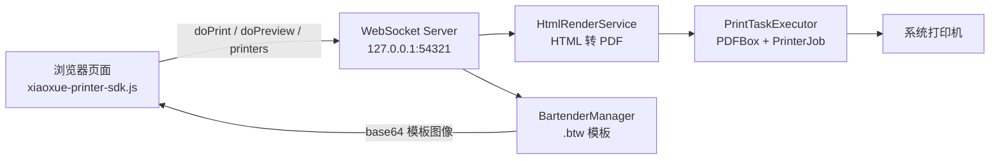

<div align="center">

# Xiaoxue WEB Printer

**晓雪 WEB 打印控件 — 浏览器里的本地打印，一行 SDK 全搞定**


</div>

---

## 这是什么

一个驻留在**系统托盘**的本机打印服务。启动后没有主窗口，只在后台静默运行：

- 浏览器页面通过 **WebSocket**（仅 `127.0.0.1:54321`）发送打印请求
- 服务端将 `text` / `html` 渲染为 PDF（OpenHTMLtoPDF）
- 再交给 **Java Print Service** 输出到真实打印机

同时内置 **BarTender 标签模板**打印能力（模板参数获取、模板图像预览、带参数渲染），适合条码 / 标签 / 出入库单等场景。

## 核心特性

| 特性                   | 说明                                                                                  |
| -------------------- | ----------------------------------------------------------------------------------- |
| 🖨️ **静默打印**         | `doPrint` 一次调用：创建任务 → 渲染 PDF → 送打印机，全程无弹窗                                           |
| 👀 **打印预览**          | `doPreview` 打开多页预览窗：缩放、翻页、页面设置、导出 PDF / 图片                                          |
| 🏷️ **BarTender 集成** | 读取 `.btw` 模板参数、渲染模板预览图（base64）、带参数渲染；本机未装 BarTender 时自动降级不影响主流程                     |
| 📋 **任务管理**          | 任务列表 / 状态查询 / 取消 / 清除，状态变化实时广播 `task_list_update`                                   |
| 🔒 **仅本机监听**         | WebSocket 只绑定回环地址，不对局域网暴露                                                           |
| 🔐 **离线授权**          | 机器码 + RSA 非对称签名授权码，绑定设备与有效期                                                         |
| 🧩 **多框架 SDK**       | `xiaoxue-printer-sdk.js` 零依赖，自动重连，Promise 化 API；提供 Vue2 / Vue3 / React / Angular 演示 |
| 📦 **一键打包**          | 一条命令产出自带 JRE 的 Windows 安装包（ProGuard 混淆 + jpackage + Inno Setup）                     |

## 工作原理



**打印链路**（`doPrint` 与预览窗"打印"按钮共用）：

1. `HtmlRenderService` 将 text/html + style 编排为 XHTML（`@page` 定义纸张/边距/页眉页脚，图片内嵌）
2. OpenHTMLtoPDF 渲染为 PDF（Windows 自动注册宋体、微软雅黑等字体）
3. `PrintTaskExecutor` 通过 PDFBox `PDFPageable` + `PrinterJob` 输出到打印机

## 目录

- [快速开始](#快速开始)
- [WebSocket 协议](#websocket-协议)
- [浏览器 SDK](#浏览器-sdk)
- [BarTender 标签打印](#bartender-标签打印)
- [授权机制](#授权机制)
- [打包发布](#打包发布)
- [配置](#配置)
- [项目结构](#项目结构)
- [常见问题](#常见问题)

## 快速开始

### 环境要求

- JDK 17+
- Maven 3.6+
- Windows x86_64（默认 SWT 平台包；macOS / Linux 需替换依赖，见 [跨平台](#跨平台)）

### 编译运行

```bash
mvn clean package
java -jar target/dreamer-print-service-1.0.3.jar
```

或在 IDE 中直接运行 `cc.iteachyou.printservice.MainApp#main`。启动成功后系统托盘会出现打印控件图标。

### 验证服务

```bash
# 端口监听检查
netstat -ano | findstr 54321

# 浏览器打开演示页（需先启动服务）
demo/index.html
```

托盘交互：

- **双击图标**：打开任务列表
- **右键菜单**：任务列表 / 授权许可 / 关于 / 退出

## WebSocket 协议

服务地址：`ws://127.0.0.1:54321`，消息为 JSON 文本帧。连接成功后服务端先推送一条欢迎消息：

```json
{ "type": "welcome", "message": "已连接到打印控件 WebSocket 服务", "port": 54321 }
```

### 指令一览

| type                               | 参数                                | 响应 type                                   | 说明                       |
| ---------------------------------- | --------------------------------- | ----------------------------------------- | ------------------------ |
| `doPrint`                          | `printer` / `style` / `content`   | `doPrint_result`                          | 提交并执行打印（旧版 `submit` 已移除） |
| `doPreview`                        | 同 `doPrint`                       | `doPreview_result`                        | 打开预览窗，不打印                |
| `printers`                         | —                                 | `printers_result`                         | 本机打印机列表                  |
| `pageSize`                         | `printerName`                     | `pageSize_result`                         | 指定打印机支持的纸张类型             |
| `list`                             | —                                 | `list_result`                             | 打印任务列表                   |
| `status`                           | `taskId`                          | `status_result`                           | 单个任务状态                   |
| `cancel`                           | `taskId`                          | `cancel_result`                           | 取消待打印任务                  |
| `clear`                            | —                                 | `clear_result`                            | 清除已完成 / 失败任务             |
| `bartenderInstance`                | —                                 | `bartenderInstance_result`                | BarTender 可用性与版本         |
| `bartenderTemplateParams`          | `templatePath`                    | `bartenderTemplateParams_result`          | 获取模板参数定义                 |
| `bartenderTemplateImage`           | `templatePath` / `dpi`            | `bartenderTemplateImage_result`           | 渲染模板图像（base64）           |
| `bartenderTemplateImageWithParams` | `templatePath` / `params` / `dpi` | `bartenderTemplateImageWithParams_result` | 带参数渲染模板图像（base64）        |

任务状态变化时，服务端向所有已连接客户端广播：

```json
{ "type": "task_list_update", "tasks": [ ... ] }
```

### doPrint 载荷示例

```json
{
  "type": "doPrint",
  "printer": "默认打印机",
  "style": {
    "paper": "A4",
    "direction": "vertical",
    "margin": { "top": 1, "right": 1, "bottom": 1, "left": 1 },
    "fontFamily": "宋体",
    "fontSize": 12,
    "zoom": 1,
    "paperHeader": "",
    "paperFooter": ""
  },
  "content": { "type": "text", "value": "打印内容" }
}
```

- `content.type`：`text`（纯文本）或 `html`（HTML 片段）
- `direction`：`vertical`（纵向）/ `horizontal`（横向）

响应：

```json
{ "type": "doPrint_result", "success": true, "taskId": "a1b2c3d4", "message": "打印任务已提交" }
```

服务端创建任务后异步渲染并打印，完成后自动从任务列表清除。`doPreview` 载荷与 `doPrint` 完全相同；相同 printer/style/content 的重复预览会激活已有窗口，不会重复弹窗。

## 浏览器 SDK

`xiaoxue-printer-sdk.js`（另有压缩版 `.min.js`）零依赖，浏览器直接引入或 Node.js `require` 均可：

```html
<script src="xiaoxue-printer-sdk.js"></script>
<script>
  const sdk = new DreamerPrinterSDK({
    url: 'ws://127.0.0.1:54321',  // 默认值
    autoReconnect: true,           // 断线自动重连
    reconnectDelay: 3000,          // 重连间隔（毫秒）
    connectionTimeout: 5000        // 连接超时（毫秒）
  });

  // 事件订阅：open / close / error / message / welcome / taskListUpdate
  sdk.on('open', () => console.log('打印服务已连接'));
  sdk.on('taskListUpdate', tasks => console.log('任务变化', tasks));

  // Promise 化 API（未连接时自动连接）
  sdk.getPrinters().then(r => console.log(r.printers));

  sdk.doPrint({
    printer: 'HP LaserJet',
    style: { paper: 'A4', fontFamily: '宋体', fontSize: 12 },
    content: { type: 'html', value: '<h1>标题</h1><p>正文</p>' }
  }).then(r => console.log('任务ID:', r.taskId));

  sdk.doPreview({ /* 参数同 doPrint */ });
</script>
```

### SDK API

| 方法                                | 返回                          | 说明                |
| --------------------------------- | --------------------------- | ----------------- |
| `doPrint(json)`                   | `Promise<doPrint_result>`   | 提交打印              |
| `doPreview(json)`                 | `Promise<doPreview_result>` | 打开预览              |
| `getPrinters()`                   | `Promise<{printers:[]}>`    | 打印机列表             |
| `getPageSize(name)`               | `Promise<{sizes:[]}>`       | 打印机支持纸张           |
| `getTaskList()`                   | `Promise<{tasks:[]}>`       | 任务列表              |
| `getTaskStatus(id)`               | `Promise<task>`             | 任务状态              |
| `cancelTask(id)` / `clearTasks()` | `Promise<result>`           | 取消 / 清除任务         |
| `getBartenderInstance()`          | `Promise<Bartender>`        | 获取 BarTender 实例对象 |

完整交互示例见 `demo/` 目录（含普通打印与 BarTender 打印）：`index.html` 入口导航 + Vue2 / Vue3 / React / Angular 四套框架集成示例。

## BarTender 标签打印

本机安装 BarTender 软件后，可调用标签模板能力（未安装时自动降级为不可用，不影响普通打印）：

```js
const bt = await sdk.getBartenderInstance();

if (bt.available) {
  console.log('BarTender 版本:', bt.version);

  // 1. 获取模板参数定义（参数名 + 控件类型）
  const { params } = await bt.getTemplateParams('D:/labels/sample.btw');
  // params: [{ name: '条码', type: 'Barcode' }, { name: '品名', type: 'Text' }, ...]

  // 2. 带参数渲染模板预览图（base64，dpi 默认 300）
  const { image } = await bt.getTemplateImageWithParams('D:/labels/sample.btw', {
    条码: '6901234567890',
    品名: '灭火器'
  });
  document.querySelector('img').src = 'data:image/png;base64,' + image;
}
```

- `type` 为控件类型粒度（Barcode / Text / Picture / RichText / RFID 等，条码不细分 QRCode / Code128）
- 模板图像同样可用于前端预览后再决定是否打印

## 授权机制

采用**离线非对称签名授权**：

- 授权码由授权工具（`dreamer-print-service-authorization` 项目）用**私钥**签发，绑定**机器码**与**有效期**
- 客户端内置公钥验签：签名无效、机器码不匹配、过期均判定为未授权
- 授权码持久化于 `~/.dreamer-print/license.dat`
- 托盘菜单「授权许可」可查看本机机器码、录入授权码、取消授权（含邮箱联系入口）

> 私钥仅存于授权工具项目，客户端无法伪造授权码。

## 打包发布

### 一键打包（推荐）

```bat
build\打包.bat
```

脚本（`build/build.ps1`）会自动完成：版本号同步（pom / iss / proguard）→ ProGuard 混淆 → 复制依赖 → jpackage 生成自带 JRE 的绿色版 → Inno Setup 产出安装包。

产物：`build\windows-晓雪WEB打印控件-<版本>-x86_64.exe`

### 手动打包（STS 视角）

> ⚠️ **关键前提**：**不要用 shade 生成的 fat jar 打包**。SWT 的 native 库（dll）打进 fat jar 后会加载失败，运行时报 `Libraries for platform win32 cannot be loaded because of incompatible environment`。正确做法是「瘦 jar + 全部原始依赖 jar」交给 jpackage。

1. **构建**：STS 中 `Run As → Maven build...`，Goals 填 `clean package`。`target` 下产出两个 jar：
   - `dreamer-print-service-x.y.z.jar` — fat jar，仅用于 `java -jar` 运行
   - `original-dreamer-print-service-x.y.z.jar` — 瘦 jar，jpackage 用这个
2. **复制依赖**：`mvn dependency:copy-dependencies -DoutputDirectory=build\libs`（保持 SWT jar 原始结构）
3. **准备输入**：瘦 jar 重命名后与全部依赖 jar 一起放入 `build\input`
4. **jpackage**：
   ```bat
   jpackage --type app-image --name 晓雪WEB打印控件 --app-version x.y.z --vendor iteachyou ^
     --input build\input --main-jar dreamer-print-service-x.y.z.jar ^
     --main-class cc.iteachyou.printservice.MainApp ^
     --icon build\dreamer-print.ico --dest build\app-image
   ```
5. **Inno Setup**：`ISCC.exe build\dreamer-print.iss`（中文/英文向导、可选桌面图标与开机自启、含卸载项）

### 打包后验证

1. 运行 exe，系统托盘出现图标
2. `netstat -ano | findstr 54321` 有监听
3. 浏览器打开 `demo/index.html`，`getPrinters()` 能返回打印机列表

## 配置

WebSocket 监听地址在 `MainApp` 中定义：

```java
public static final String WS_HOST = "127.0.0.1";
public static final int WS_PORT = 54321;
```

默认只绑回环地址。若确需局域网访问，改为 `0.0.0.0`，并**自行增加鉴权**（本项目未内置）。

### 跨平台

SWT 按平台区分 artifactId，替换 `pom.xml` 中的依赖即可：

| 平台                 | artifactId                             |
| ------------------ | -------------------------------------- |
| Windows x86_64（默认） | `org.eclipse.swt.win32.win32.x86_64`   |
| macOS aarch64      | `org.eclipse.swt.cocoa.macosx.aarch64` |
| Linux x86_64       | `org.eclipse.swt.gtk.linux.x86_64`     |

## 项目结构

```
dreamer-print-service/
├── pom.xml                              # Maven 构建配置（shade 打 fat jar）
├── xiaoxue-printer-sdk.js               # 浏览器 / Node 客户端 SDK（源码）
├── xiaoxue-printer-sdk.min.js           # SDK 压缩混淆版
├── demo/                                # 演示页（入口导航 + 四大框架示例）
│   ├── index.html
│   ├── normal-print-demo.html           # 普通打印 + BarTender 示例
│   ├── print-demo-vue2.html / print-demo-vue3.html
│   ├── print-demo-react.html / print-demo-anjular.html
├── build/                               # 打包脚本与产物
│   ├── build.ps1 / 打包.bat             # 一键打包
│   ├── dreamer-print.iss                # Inno Setup 脚本
│   ├── dreamer-print.ico                # 应用图标（7 种尺寸）
│   └── proguard.pro                     # ProGuard 混淆规则
├── RELEASE-NOTES.md                     # 版本历史
└── src/main/
    ├── java/cc/iteachyou/printservice/
    │   ├── MainApp.java                 # 启动入口（托盘 + WebSocket + SWT 事件循环）
    │   ├── tray/SystemTrayManager.java  # SWT 原生托盘与菜单
    │   ├── websocket/
    │   │   ├── PrintWebSocketServer.java# WebSocket 服务与指令分发
    │   │   └── PrintTask.java           # 打印任务模型
    │   ├── print/
    │   │   ├── HtmlRenderService.java   # text/html → XHTML → PDF
    │   │   ├── PrintTaskExecutor.java  # PDF → 打印机
    │   │   ├── PaperSizeUtil.java       # 纸张尺寸工具
    │   │   └── bartender/              # BarTender 集成（懒加载单例）
    │   ├── ui/                          # 预览 / 任务列表 / 关于 / 授权窗体
    │   └── util/                        # LicenseManager / MachineCode / VersionUtil / AppIcons
    └── resources/
        ├── simplelogger.properties      # 日志配置
        └── version.properties           # 版本号（由 pom 注入，自动同步）
```

## 常见问题

### 托盘图标不显示？

SWT `display.getSystemTray()` 在 Windows / macOS 上支持；Linux 部分桌面环境需要安装托盘扩展。

### 如何开机自启？

- **Windows**：快捷方式放入「启动」文件夹，或安装包勾选「开机自启」
- **macOS**：登录项
- **Linux**：systemd 用户服务或 `.desktop`

### 运行 exe 无反应 / SWT 报平台错误？

典型症状 `Libraries for platform win32 cannot be loaded...`，原因是用 fat jar 打包导致 SWT 本地库损坏。解决见[打包发布](#打包发布)中的「瘦 jar + 原始依赖」流程。

### 为什么不用 dorkbox SystemTray？

dorkbox 在 Windows 原生托盘上有已知 bug（`bounds is null`，issue #209）。本项目改用 SWT 原生托盘，彻底规避。

### `submit` 指令报错？

旧版 `submit` 已移除，统一使用 `doPrint`。

## 版本历史

见 [RELEASE-NOTES.md](RELEASE-NOTES.md)。

## License

[MIT](LICENSE)

